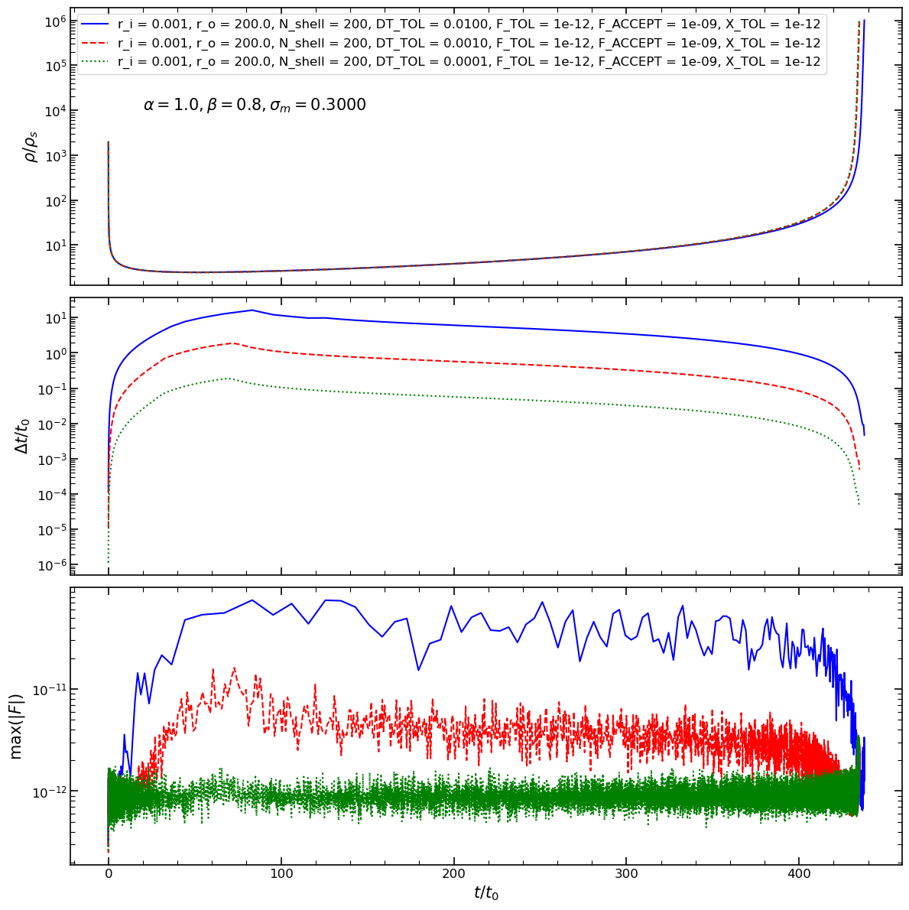

# SIDM Gravothermal Fluid Solver

[](https://sidm-gtf.readthedocs.io/en/latest/)


A one-dimensional Lagrangian fully-implicit coupled gravothermal fluid solver for
self-interacting dark matter halos. The code and associated convergence tests will be 
described in Dutta Chowdhury and Croton (in prep).

All quantities are in dimensionless units following standard gravothermal evolution work
such as Balberg 2002, Nishikawa 2020, etc.

However, contrary to standard work where the energy equation is first solved, 
holding the geometry fixed, and the system is then allowed to 
adiabatically re-adjust to hydrostatic equilibrium, we simultaneously solve the 
coupled energy conservation and hydrostatic equlibrium equations uisng a
fully-implicit scheme.

## Key Features

- Spherically symmetric halo evolution
- Hydrostatic equilibrium and energy conservation
- Conductive heat transport
- Fully implicit time integration
- Coupled hydrostatic and energy residuals
- Analytical Jacobian
- Newton iterations for root finding
- Currently supports NFW initial conditions (with optional truncation)

## Citation

If you use this software in a publication or want to refer to it, please cite:

```bibtex
@article{duttachowdhury26,
  title = {A Fully-Implicit Coupled Gravothermal Fluid Solver for SIDM Halos},
  author = {Dutta Chowdhury, Dhruba and Croton, Darren J.},
  year = 2026,
  journal = {in prep},
}
```

## Installation

### Install from PyPI

Once released, the package can be installed using `pip`:

```bash
pip install SIDM-GTF
```

### Install from GitHub

To obtain the latest public version directly from GitHub:

```bash
git clone https://github.com/dhrubadc/SIDM-GTF.git
cd SIDM-GTF
pip install .
```

## Walkthrough

First we import the required modules.

```python
import time
import shutil
import os

from gtf import constants
from gtf import initial_conditions
from gtf import state
from gtf import time_evolution

import config
```
Here, config.py is in the working directory and contains all essential parameters for the code to run.


We then set the values for all the runtime parameters.

```python
r_first = constants.FLOATDTYPE(config.R_FIRST)

constants.R_OUTER = constants.FLOATDTYPE(config.R_OUTER)
constants.N_SHELL = config.N_SHELL

constants.SIGMA_OVER_M = constants.FLOATDTYPE(config.SIGMA_OVER_M)
constants.BETA = constants.FLOATDTYPE(config.BETA)
constants.ALPHA = constants.FLOATDTYPE(config.ALPHA)

constants.F_TOL = constants.FLOATDTYPE(config.F_TOL)
constants.F_ACCEPT = constants.FLOATDTYPE(config.F_ACCEPT)
constants.X_TOL = constants.FLOATDTYPE(config.X_TOL)
constants.ITER_MAX = config.ITER_MAX

constants.DT_TOL = constants.FLOATDTYPE(config.DT_TOL)

constants.RHO_STOP = constants.FLOATDTYPE(config.RHO_STOP)
constants.OUTPUT_FACTOR = constants.FLOATDTYPE(config.OUTPUT_FACTOR)
constants.RUN_ID = config.RUN_ID

out_direc = f"data/run_{constants.RUN_ID:d}/"

if os.path.exists(out_direc):
    shutil.rmtree(out_direc)

os.makedirs(out_direc)

constants.OUT_DIREC = out_direc 
```

Next, we set up the initial NFW halo.

```python
ln_r_edge, u = initial_conditions.set_up_initial_conditions(r_first)
```
A truncated NFW can also be set up by providing additional arguments r_t and n.


The initial state of the system is now created with all relevant state variables.

```python
state_init = state.state_from_unknowns(ln_r_edge, u)
```


Finally, the halo is evolved until the central density is greater than constants.RHO_STOP.

```python
start_time = time.perf_counter()

time_evolution.evolve(state_init)

end_time = time.perf_counter()

execution_time = end_time - start_time

print(execution_time)
```

Example config files and a run script, which takes the config file as an argument, are provided in the examples folder.

## Convergence Tests
Results of three different runs are shown in this figure, 
which tests for convergence in the central density evolution with respect to time-stepping.
.

This section will be updated with more results.

## Acknowledgements
ChatGPT (Open AI) has been used during development for code-error fixes, consistency checks, and some idea brainstorming, such as convergence criteria for the Newton iterations, line search to keep the Newton variables physical, and timestep controller. All AI-made suggestions were extensively reviewed and verified by the authors before their inclusion in the code-base, and therefore, ownership and accountability for the same lies with the authors.
